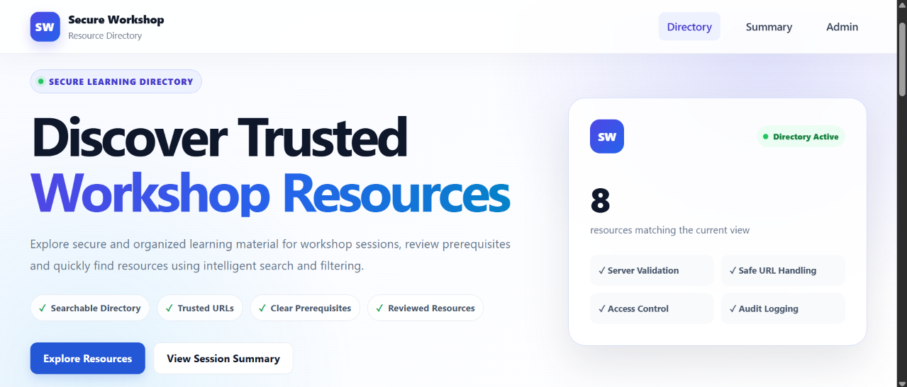
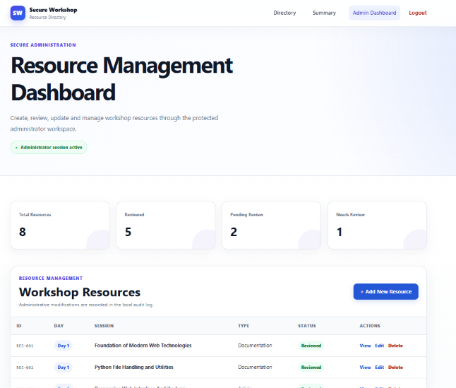
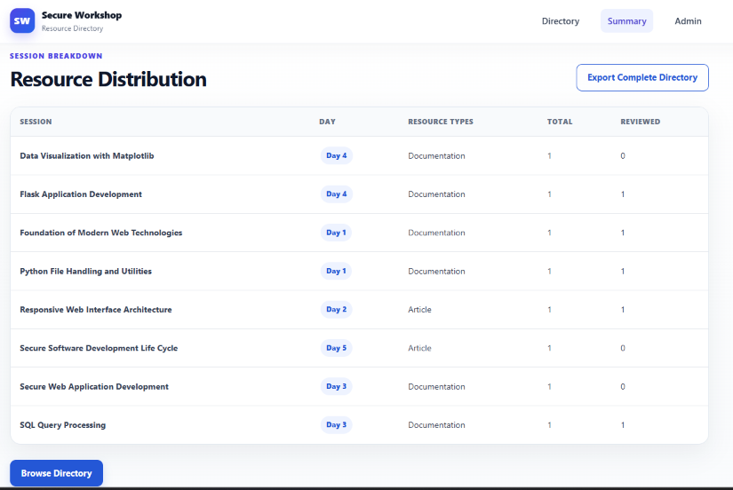
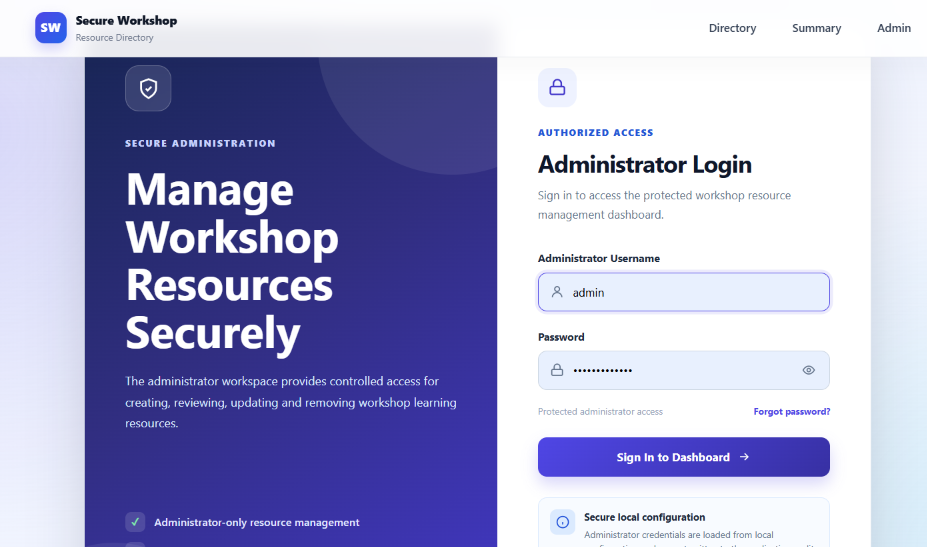
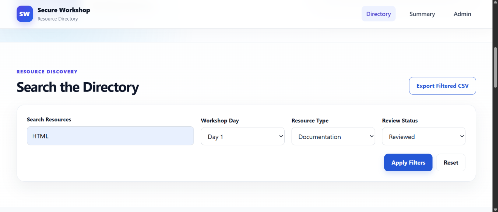
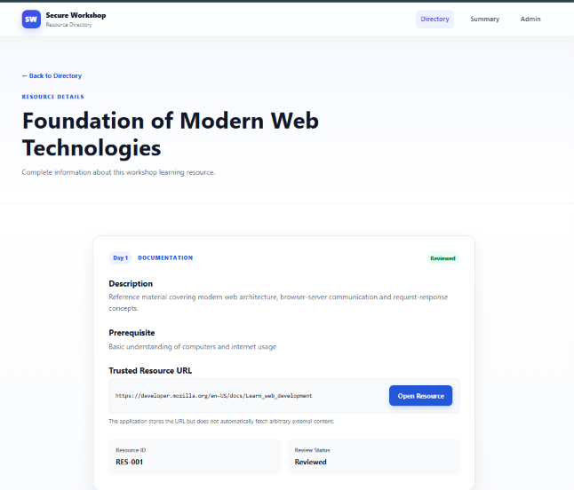
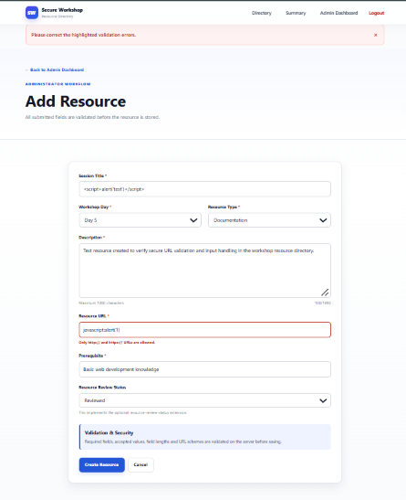
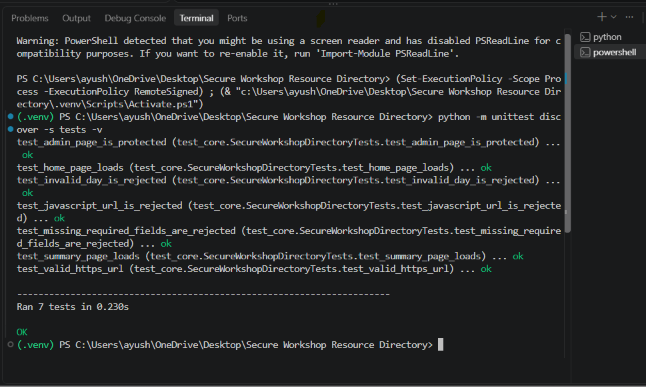
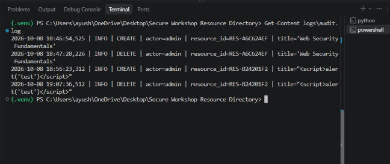

# 🔐 Secure Workshop Resource Directory

> A secure, searchable, and professionally designed workshop learning-resource management application built with **Python and Flask**, demonstrating practical **Secure Application Development**, **SSDLC**, **input validation**, **administrator access control**, **audit logging**, and **security testing**.

<p align="center">
  <strong>Mini-Project B — Secure Workshop Resource Directory</strong><br>
  Secure Application Development Workshop
</p>

---

## 📌 Project Overview

The **Secure Workshop Resource Directory** is a Flask-based web application designed to provide workshop participants with a centralized place to discover and access trusted learning resources.

Participants can browse workshop sessions, search resources, apply filters, view prerequisites, inspect resource details, review session-wise summaries, and export filtered data.

The project also provides a protected **Administrator Workspace** where authorized administrators can:

- Create workshop resources
- Update existing records
- Delete resources
- Manage resource-review status
- View directory statistics
- Monitor administrative activity through audit logs

The project focuses not only on functionality but also on applying secure development practices throughout the application lifecycle.

---

# 📸 Project Preview

<table>
  <tr>
    <td width="50%" align="center">
      <strong>Public Resource Directory</strong>
      <br><br>
      
    </td>
    <td width="50%" align="center">
      <strong>Administrator Dashboard</strong>
      <br><br>
      
    </td>
  </tr>

  <tr>
    <td width="50%" align="center">
      <strong>Session-wise Resource Summary</strong>
      <br><br>
      
    </td>
    <td width="50%" align="center">
      <strong>Secure Administrator Login</strong>
      <br><br>
      
    </td>
  </tr>
</table>

---

# 📑 Table of Contents

- [Project Context](#-project-context)
- [Problem Statement](#-problem-statement)
- [Project Objectives](#-project-objectives)
- [Main Features](#-main-features)
- [User Roles](#-user-roles)
- [Technology Stack](#-technology-stack)
- [System Architecture](#-system-architecture)
- [Application Workflow](#-application-workflow)
- [Project Structure](#-project-structure)
- [Resource Data Model](#-resource-data-model)
- [Security Architecture](#-security-architecture)
- [Security Controls](#-security-controls)
- [Administrator Authentication](#-administrator-authentication)
- [Password Recovery](#-password-recovery)
- [Search and Filtering](#-search-and-filtering)
- [CSV Export](#-csv-export)
- [Audit Logging](#-audit-logging)
- [SSDLC Implementation](#-ssdlc-implementation)
- [Threat Model](#-threat-model)
- [Testing](#-testing)
- [Security Testing](#-security-testing)
- [Screenshots](#-screenshots)
- [Installation and Setup](#-installation-and-setup)
- [Application Routes](#-application-routes)
- [Clean Environment Setup](#-clean-environment-setup)
- [Known Limitations](#-known-limitations)
- [Future Improvements](#-future-improvements)
- [Demonstration Flow](#-demonstration-flow)
- [Security and Ethics](#-security-and-ethics)
- [Conclusion](#-conclusion)

---

# 🎓 Project Context

This project was developed as:

## **Mini-Project B — Secure Workshop Resource Directory**

for the **Secure Application Development** workshop.

The application demonstrates practical concepts including:

- Web application architecture
- Secure Flask development
- Search and filtering
- Server-side validation
- URL-scheme validation
- Administrator-only editing
- Authentication
- Password hashing
- Audit logging
- Configuration hygiene
- CSRF protection
- Safe template rendering
- Security testing
- Threat modelling
- Secure Software Development Life Cycle practices

---

# 🎯 Problem Statement

Workshop participants often receive learning resources across multiple sessions and topics.

Without a structured system, it can become difficult to:

- Find session-specific learning material
- Identify required prerequisites
- Search resources quickly
- Filter resources by day or type
- Verify whether a resource has been reviewed
- Maintain trusted resource URLs
- Manage the directory securely

The project solves this problem by providing a centralized and searchable resource directory.

At the same time, modification operations are restricted to an administrator so normal users cannot change workshop-resource records.

---

# 🚀 Project Objectives

The primary objectives are to:

1. Build a searchable workshop-resource application.
2. Provide clear and professional navigation.
3. Store session title, day, resource type, description, URL, prerequisite, and review status.
4. Implement resource listing and detailed resource views.
5. Provide search and multi-field filtering.
6. Validate all submitted resource records.
7. Validate resource URL schemes.
8. Restrict create, update, and delete operations to administrators.
9. Record administrator activity safely.
10. Generate session-wise resource summaries.
11. Export filtered directory records.
12. Test malicious-looking but harmless input.
13. Keep local configuration outside source code.
14. Document the architecture and threat model.
15. Demonstrate setup from a clean environment.
16. Apply basic SSDLC practices throughout development.

---

# ✨ Main Features

## 🌐 Public Resource Directory

Normal users can:

- Browse all workshop resources
- Search resources
- Filter by workshop day
- Filter by resource type
- Filter by review status
- View resource descriptions
- View prerequisites
- View trusted resource URLs
- Open resource-detail pages
- View session-wise summaries
- Export filtered results as CSV

No login is required for normal users.

---

## 🔐 Administrator Workspace

The administrator can:

- Login through a protected admin page
- View resource statistics
- Add new resources
- Edit resources
- Delete resources
- Change review status
- Logout securely
- Reset the local administrator password
- View administrative actions through audit logs

---

## 🔎 Search and Filtering

The public resource directory supports:

- Free-text search
- Workshop-day filter
- Resource-type filter
- Review-status filter
- Combined filtering

Example:

```text
Search: HTML
Day: 1
Resource Type: Documentation
Review Status: Reviewed
```

The directory returns only records matching the selected conditions.

---

## 📝 Resource Detail View

Each resource-detail page displays:

- Resource ID
- Session title
- Workshop day
- Resource type
- Description
- Prerequisite
- Trusted resource URL
- Review status

---

## 📊 Session-wise Summary

The application generates a structured summary containing:

- Session title
- Workshop day
- Resource type
- Total resources
- Reviewed-resource count

This provides a simple analytical overview of available workshop material.

---

## 📥 Filtered CSV Export

The current filtered resource list can be exported as a CSV file.

Exported columns include:

```text
ID
Session Title
Day
Resource Type
Description
URL
Prerequisite
Review Status
```

This allows workshop resource information to be reused outside the application.

---

## ✅ Resource Review Extension

The optional resource-review-status extension is implemented.

Supported statuses:

```text
Pending
Reviewed
Needs Review
```

This allows administrators to identify resources that may require verification.

---

# 👥 User Roles

## Normal User

Normal users have read-only access.

They can:

```text
Browse
Search
Filter
View Details
View Summary
Export CSV
```

They cannot:

```text
Create
Edit
Delete
Change Resource Status
Access Admin Dashboard
```

---

## Administrator

The administrator has controlled access to resource-management operations.

```text
Administrator
      |
      v
Secure Login
      |
      v
Admin Dashboard
      |
      +---- Create Resource
      |
      +---- Update Resource
      |
      +---- Delete Resource
      |
      +---- Change Review Status
      |
      +---- Logout
```

---

# 🛠 Technology Stack

| Technology | Purpose |
|---|---|
| **Python** | Core application and business logic |
| **Flask** | Web application framework |
| **HTML5** | Application page structure |
| **CSS3** | Responsive UI/UX design |
| **JavaScript** | Client-side interactions |
| **Jinja2** | Server-side HTML rendering |
| **JSON** | Workshop-resource persistence |
| **Python Logging** | Audit logging |
| **python-dotenv** | Environment-variable management |
| **Werkzeug Security** | Password hashing and verification |
| **CSV** | Filtered resource export |
| **unittest** | Automated application testing |

---

# 🏗 System Architecture

The project follows a lightweight layered web architecture.

```text
                         ┌─────────────────────────┐
                         │       NORMAL USER       │
                         │                         │
                         │ Browse / Search / Filter│
                         │ Details / Summary / CSV │
                         └────────────┬────────────┘
                                      │
                                      │ HTTP Request
                                      ▼
              ┌──────────────────────────────────────┐
              │          FLASK APPLICATION           │
              │                app.py                │
              └───────────┬──────────┬───────────────┘
                          │          │
              ┌───────────┘          └────────────┐
              ▼                                   ▼
     ┌─────────────────┐                 ┌─────────────────┐
     │ validators.py   │                 │     auth.py     │
     │                 │                 │                 │
     │ Required fields │                 │ Admin password  │
     │ URL validation  │                 │ Authentication  │
     │ Length checks   │                 │ Password reset  │
     │ Allowed values  │                 │ Password hash   │
     └────────┬────────┘                 └────────┬────────┘
              │                                   │
              ▼                                   ▼
     ┌─────────────────┐                 ┌──────────────────┐
     │   storage.py    │                 │ admin_auth.json  │
     │                 │                 │ Local hash only  │
     │ Create          │                 └──────────────────┘
     │ Read            │
     │ Update          │
     │ Delete          │
     └────────┬────────┘
              │
              ▼
     ┌─────────────────────┐
     │ data/resources.json │
     │                     │
     │ Workshop resources  │
     └─────────────────────┘


                  FLASK APPLICATION
                         |
              +----------+----------+
              |                     |
              v                     v
      ┌───────────────┐     ┌───────────────┐
      │  audit.log    │     │     .env      │
      │               │     │               │
      │ CREATE        │     │ Secret Key    │
      │ UPDATE        │     │ Admin Config  │
      │ DELETE        │     │ Recovery Code │
      │ PASSWORD_RESET│     │ App Mode      │
      └───────────────┘     └───────────────┘
```

Detailed architecture documentation:

```text
docs/architecture.md
```

---

# 🔄 Application Workflow

## Public User Workflow

```text
User Opens Application
        |
        v
Resource Directory
        |
        +---- Search
        |
        +---- Apply Filters
        |
        +---- View Details
        |
        +---- View Summary
        |
        +---- Export CSV
```

---

## Administrator Workflow

```text
Administrator
      |
      v
Admin Login
      |
      v
Credential Verification
      |
      v
Protected Dashboard
      |
      +---- Add Resource
      |
      +---- Edit Resource
      |
      +---- Delete Resource
      |
      +---- Change Status
      |
      +---- Logout
```

---

# 📂 Project Structure

```text
Secure Workshop Resource Directory/
│
├── app.py
├── auth.py
├── storage.py
├── validators.py
│
├── README.md
├── requirements.txt
├── .env.example
├── .gitignore
│
├── templates/
│   ├── base.html
│   ├── index.html
│   ├── resource_detail.html
│   ├── admin_login.html
│   ├── forgot_password.html
│   ├── admin_dashboard.html
│   ├── resource_form.html
│   ├── summary.html
│   ├── 400.html
│   ├── 404.html
│   └── 500.html
│
├── static/
│   ├── css/
│   │   ├── style.css
│   │   ├── premium.css
│   │   └── login.css
│   │
│   └── js/
│       └── app.js
│
├── data/
│   └── resources.json
│
├── docs/
│   ├── architecture.md
│   ├── threat_model.md
│   └── test_report.md
│
├── tests/
│   └── test_core.py
│
└── screenshots/
    ├── 01-home-directory.png
    ├── 02-search-filter.png
    ├── 03-resource-details.png
    ├── 04-session-summary.png
    ├── 05-admin-login.png
    ├── 06-admin-dashboard.png
    ├── 07-add-resource.png
    ├── 08-url-validation.png
    ├── 09-automated-tests.png
    └── 10-audit-log.png
```

The following local files are intentionally excluded from Git:

```text
.env
.venv/
data/admin_auth.json
logs/*.log
__pycache__/
```

---

# 🗃 Resource Data Model

Each resource contains:

```text
Resource ID
Session Title
Workshop Day
Resource Type
Description
URL
Prerequisite
Review Status
```

Example:

```json
{
  "id": "RES-006",
  "session_title": "Flask Application Development",
  "day": 4,
  "resource_type": "Documentation",
  "description": "Official Flask documentation covering routing, templates and request handling.",
  "url": "https://flask.palletsprojects.com/",
  "prerequisite": "Python and basic web concepts",
  "review_status": "Reviewed"
}
```

---

# 🛡 Security Architecture

Security is treated as part of the application design rather than as an afterthought.

The project implements protection at multiple layers:

```text
User Input
    |
    v
Server-Side Validation
    |
    v
Authentication / Authorization
    |
    v
Safe Storage
    |
    v
Safe Template Rendering
    |
    v
Audit Logging
```

---

# 🔒 Security Controls

## 1. Server-Side Input Validation

All administrator-submitted resource data is validated before saving.

Validation includes:

- Required fields
- Workshop-day range
- Allowed resource types
- Allowed review statuses
- Maximum text lengths
- URL validation

Invalid data is rejected before storage.

---

## 2. Safe URL Validation

Only:

```text
http://
https://
```

resource URLs are accepted.

Example malicious-looking URL:

```text
javascript:alert(1)
```

is rejected.

The application also does **not automatically fetch submitted URLs**.

---

## 3. Administrator Access Control

Modification routes are protected.

Unauthenticated visitors cannot directly access:

```text
/admin
/admin/resource/new
/admin/resource/<id>/edit
/admin/resource/<id>/delete
```

They are redirected to the administrator login page.

---

## 4. Session-Based Authorization

After valid authentication, the administrator receives a server-managed session.

Protected routes verify the administrator session before allowing resource-management operations.

---

## 5. CSRF Protection

State-changing forms include session-generated CSRF tokens.

Protected operations include:

- Create
- Update
- Delete
- Logout
- Password reset

Invalid or missing tokens are rejected.

---

## 6. Safe Template Rendering

Flask/Jinja automatically escapes normal template variables.

Test input:

```text
<script>alert('test')</script>
```

is displayed as text rather than intentionally executed as JavaScript.

---

## 7. Configuration Hygiene

Sensitive local configuration is stored in:

```text
.env
```

and excluded from Git.

The repository contains only:

```text
.env.example
```

with placeholder values.

---

## 8. Password Hashing

When the administrator password is reset, the new password is stored using Werkzeug password hashing.

The plain-text password is not stored in the generated authentication file.

---

## 9. Audit Logging

Administrator modification operations are logged.

Examples:

```text
CREATE
UPDATE
DELETE
PASSWORD_RESET
```

Passwords and recovery codes are not intentionally written to the audit log.

---

## 10. Generic Error Handling

The application includes custom:

```text
400
404
500
```

error pages.

Unexpected technical information is not intentionally exposed to normal users.

---

# 👨‍💼 Administrator Authentication

Administrator authentication is handled separately from public browsing.

```text
Admin Login
    |
    v
Username Verification
    |
    v
Password Verification
    |
    v
Administrator Session
    |
    v
Protected Dashboard
```

Credentials are loaded from local environment configuration.

They are not embedded directly inside public templates.

---

# 🔑 Password Recovery

The local workshop prototype includes password recovery.

```text
Forgot Password
      |
      v
Username
      |
      v
Recovery Code
      |
      v
Validate Recovery Data
      |
      v
New Password Validation
      |
      v
Generate Password Hash
      |
      v
Save Local Hash
      |
      v
Login Using New Password
```

Password validation requires:

- Minimum 8 characters
- Uppercase character
- Lowercase character
- Number
- Special character

---

# 🔎 Search and Filtering

The directory supports combined filtering.

Searchable information includes:

- Session title
- Resource type
- Description
- Prerequisite

Additional filters:

```text
Day
Resource Type
Review Status
```

Users can apply several conditions simultaneously.

---

# 📤 CSV Export

Users can export the currently filtered resource directory.

Example file:

```text
filtered_workshop_resources.csv
```

This demonstrates practical data portability while keeping the original dataset intact.

---

# 📜 Audit Logging

Administrative changes are written locally to:

```text
logs/audit.log
```

Example structure:

```text
2026-10-08 ... | INFO | CREATE | actor=admin | resource_id=...
2026-10-08 ... | INFO | UPDATE | actor=admin | resource_id=...
2026-10-08 ... | INFO | DELETE | actor=admin | resource_id=...
```

The log provides an audit trail of resource-management activity.

---

# 🔄 SSDLC Implementation

The project applies fundamental **Secure Software Development Life Cycle** practices.

## Requirements Phase

Defined:

- Intended users
- Public functionality
- Administrator functionality
- Resource data fields
- Security requirements
- Scope limitations

---

## Design Phase

The application separates:

- UI templates
- Application routing
- Validation
- Authentication
- Storage
- Logging
- Configuration

---

## Threat Modelling Phase

Threats considered include:

- Unauthorized resource modification
- Unsafe URL schemes
- Malicious-looking HTML input
- CSRF
- Sensitive configuration exposure
- Sensitive data in logs
- Direct access to administrator routes

---

## Secure Implementation Phase

Implemented:

- Server-side validation
- Administrator authorization
- CSRF validation
- Safe template rendering
- Audit logging
- Environment variables
- Password hashing
- Generic error handling

---

## Verification Phase

Testing covers:

- Normal cases
- Invalid inputs
- Unauthorized access
- Unsafe URLs
- Required fields
- Malicious-looking input
- Automated route and validation tests

---

## Operation Phase

The project contains:

- `README.md`
- `requirements.txt`
- `.env.example`
- Architecture documentation
- Threat model
- Test report
- Demonstration screenshots
- Clean setup instructions

---

# ⚠ Threat Model

Detailed threat modelling is documented in:

```text
docs/threat_model.md
```

The document covers:

- Assets
- Trust boundaries
- Threat scenarios
- Security controls
- Mitigations
- Security testing
- Known limitations

---

# 🧪 Testing

Automated tests are stored in:

```text
tests/test_core.py
```

Current automated coverage includes:

- Home page availability
- Summary page availability
- Administrator route protection
- Valid HTTPS URL acceptance
- Unsafe JavaScript URL rejection
- Invalid day rejection
- Required-field validation

Run:

```powershell
python -m unittest discover -s tests -v
```

Expected successful result:

```text
Ran 7 tests in ...
OK
```

---

# 🚨 Security Testing

The project was tested with malicious-looking but harmless input.

## Unsafe URL Test

Input:

```text
javascript:alert(1)
```

Expected:

```text
Only http:// and https:// URLs are allowed.
```

Result:

**PASS**

---

## HTML / Script-Like Input Test

Input:

```text
<script>alert('test')</script>
```

Expected:

The string should be displayed as text and JavaScript should not execute.

Result:

**PASS**

---

## Unauthorized Administrator Access Test

Action:

```text
Open /admin without authentication
```

Expected:

```text
Redirect to administrator login
```

Result:

**PASS**

---

# 📸 Screenshots

The repository includes visual evidence of the main application functionality.

| # | Screenshot | Demonstrates |
|---|---|---|
| 01 | `01-home-directory.png` | Public resource directory |
| 02 | `02-search-filter.png` | Search and filtering |
| 03 | `03-resource-details.png` | Resource-detail view |
| 04 | `04-session-summary.png` | Session summary |
| 05 | `05-admin-login.png` | Administrator login |
| 06 | `06-admin-dashboard.png` | Protected admin dashboard |
| 07 | `07-add-resource.png` | Resource creation form |
| 08 | `08-url-validation.png` | Unsafe URL rejection |
| 09 | `09-automated-tests.png` | Automated tests passing |
| 10 | `10-audit-log.png` | Audit logging |

All screenshots are located in:

```text
screenshots/
```

---

## Search & Filtering



---

## Resource Details



---

## URL Security Validation



---

## Automated Tests



---

## Audit Log



---

# ⚙ Installation and Setup

## Prerequisites

Recommended:

```text
Python 3.10+
VS Code
Git
Modern Web Browser
```

---

## Step 1 — Clone the Repository

```powershell
git clone https://github.com/Ayush0618singh/secure-workshop-resource-directory.git
```

Enter the project directory:

```powershell
cd secure-workshop-resource-directory
```

Alternatively, extract the provided project ZIP.

---

## Step 2 — Create Virtual Environment

```powershell
py -m venv .venv
```

---

## Step 3 — Activate Virtual Environment

Windows PowerShell:

```powershell
.\.venv\Scripts\Activate.ps1
```

If PowerShell blocks activation:

```powershell
Set-ExecutionPolicy -Scope Process -ExecutionPolicy Bypass
```

Then run again:

```powershell
.\.venv\Scripts\Activate.ps1
```

---

## Step 4 — Install Dependencies

```powershell
python -m pip install -r requirements.txt
```

---

## Step 5 — Create Local Environment Configuration

Copy:

```text
.env.example
```

to:

```text
.env
```

Windows PowerShell:

```powershell
Copy-Item .env.example .env
```

Configure:

```env
FLASK_SECRET_KEY=replace-with-your-local-secret-key
ADMIN_USERNAME=admin
ADMIN_PASSWORD=replace-with-your-local-admin-password
ADMIN_RECOVERY_CODE=replace-with-your-local-recovery-code
APP_ENV=production
```

Do not place real institutional credentials or production secrets inside the project.

---

## Step 6 — Run Automated Tests

```powershell
python -m unittest discover -s tests -v
```

Expected:

```text
OK
```

---

## Step 7 — Run Application

```powershell
python app.py
```

Open:

```text
http://127.0.0.1:5000
```

---

# 🛣 Application Routes

| Route | Access | Purpose |
|---|---|---|
| `/` | Public | Resource directory |
| `/resource/<id>` | Public | Resource details |
| `/summary` | Public | Session summary |
| `/export.csv` | Public | CSV export |
| `/admin/login` | Public | Administrator login |
| `/admin/forgot-password` | Public | Local password recovery |
| `/admin` | Admin | Administrator dashboard |
| `/admin/resource/new` | Admin | Create resource |
| `/admin/resource/<id>/edit` | Admin | Update resource |
| `/admin/resource/<id>/delete` | Admin | Delete resource |
| `/admin/logout` | Admin | Logout |

---

# 🧹 Clean Environment Setup

The application can be recreated from a clean environment using only repository files.

Required repository files:

```text
Source code
requirements.txt
.env.example
resources.json
templates/
static/
```

Local-only files such as:

```text
.env
.venv/
data/admin_auth.json
logs/*.log
```

are regenerated or configured on the target machine.

This demonstrates project reproducibility without committing sensitive local information.

---

# 📄 Project Documentation

Additional technical documentation is stored inside:

```text
docs/
```

Files:

```text
docs/
├── architecture.md
├── threat_model.md
└── test_report.md
```

### `architecture.md`

Contains:

- Component architecture
- User flow
- Administrator flow
- Password-reset flow
- Resource-creation flow
- Trust boundaries
- Security controls

### `threat_model.md`

Contains:

- Assets
- Threats
- Risks
- Mitigations
- Security controls
- Known limitations

### `test_report.md`

Contains:

- Functional test cases
- Security test cases
- Expected results
- Actual results
- PASS/FAIL status

---

# ⚠ Known Limitations

This application is a workshop prototype rather than a production enterprise platform.

Current limitations include:

- JSON file-based resource storage
- Single local administrator
- Local recovery-code mechanism
- No multi-user administrator database
- No account lockout
- No rate limiting
- No email-based password recovery
- No server-side external link-health checking
- No production HTTPS configuration in local mode
- Local audit-file storage
- Not designed to store sensitive institutional information

---

# 🔮 Future Improvements

Potential improvements include:

- SQLite/PostgreSQL database integration
- Multiple administrator accounts
- Role-Based Access Control
- Email-based password recovery
- Account-lockout protection
- Login rate limiting
- Resource approval workflow
- Automatic trusted-link health checks
- Advanced resource analytics
- Search pagination
- Database-backed audit logs
- Authentication event logging
- Cloud deployment
- Production HTTPS
- Automated CI testing
- Additional security test coverage
- Resource import/export tools

---

# 🎬 Demonstration Flow

Recommended presentation sequence:

### 1. Public Directory

Show the home page and explain:

> The application provides a searchable directory of workshop learning resources.

---

### 2. Search

Search for a resource such as:

```text
Flask
```

---

### 3. Filters

Apply:

```text
Day
Resource Type
Review Status
```

---

### 4. Resource Details

Open a resource and demonstrate:

```text
Description
Prerequisite
Trusted URL
Review Status
```

---

### 5. Session Summary

Open the summary page and explain the resource distribution.

---

### 6. CSV Export

Export filtered resources.

---

### 7. Administrator Login

Open the protected administrator login page.

---

### 8. Administrator Dashboard

Show:

```text
Total Resources
Reviewed
Pending
Needs Review
```

---

### 9. Create Resource

Create a valid workshop resource.

---

### 10. Update Resource

Edit the created record.

---

### 11. Security Validation

Enter:

```text
javascript:alert(1)
```

as the URL.

Explain that the server rejects unsafe URL schemes.

---

### 12. Delete Resource

Delete the demonstration record.

---

### 13. Audit Log

Show administrative:

```text
CREATE
UPDATE
DELETE
```

activity.

---

### 14. Automated Tests

Run:

```powershell
python -m unittest discover -s tests -v
```

Show:

```text
OK
```

---

### 15. Architecture

Explain:

```text
Browser
   ↓
Flask Application
   ↓
Validation / Authentication
   ↓
Storage
   ↓
Audit Logging
```

---

### 16. Threat Model

Explain at least three threats and mitigations.

Example:

| Threat | Mitigation |
|---|---|
| Unauthorized modification | Administrator access control |
| Unsafe URL | HTTP/HTTPS validation |
| Malicious HTML input | Jinja escaping |
| CSRF | Session CSRF token |
| Secret exposure | `.env` configuration |
| Sensitive logging | Restricted audit fields |

---

# 🔐 Security and Ethics

The application follows workshop security and ethics requirements.

The project:

- Uses synthetic workshop data
- Uses trusted learning-resource URLs
- Does not require real student records
- Does not require real institutional passwords
- Does not commit local secrets
- Does not automatically fetch arbitrary URLs
- Does not intentionally log administrator passwords
- Uses local demonstration credentials only
- Clearly documents security limitations

---

# 📚 Key Learning Outcomes

This project demonstrates practical understanding of:

- Flask application development
- Web architecture
- Python modularization
- HTML templating
- Responsive UI design
- Search implementation
- Data filtering
- File-based persistence
- Input validation
- URL parsing
- Authentication
- Password hashing
- Sessions
- CSRF protection
- Audit logging
- Environment variables
- Security testing
- Threat modelling
- SSDLC
- Automated testing
- Technical documentation

---

# 🏁 Conclusion

The **Secure Workshop Resource Directory** demonstrates how a small web application can be developed using secure application-development practices rather than focusing only on functionality.

The application combines:

- Professional UI/UX
- Searchable resource management
- Multi-field filtering
- Detailed resource views
- Session-wise summaries
- CSV export
- Administrator access control
- Password recovery
- Server-side validation
- Safe URL handling
- CSRF protection
- Audit logging
- Password hashing
- Configuration separation
- Automated testing
- Threat modelling
- SSDLC documentation

The result is a **secure, modular, documented, reproducible, and demonstration-ready Flask application** suitable for the **Secure Application Development workshop mini-project**.

---

## 👨‍💻 Repository

**GitHub:**  
https://github.com/Ayush0618singh/secure-workshop-resource-directory

---

<p align="center">
  <strong>Secure Workshop Resource Directory</strong>
  <br>
  Built with Python • Flask • Secure Development Practices
</p>